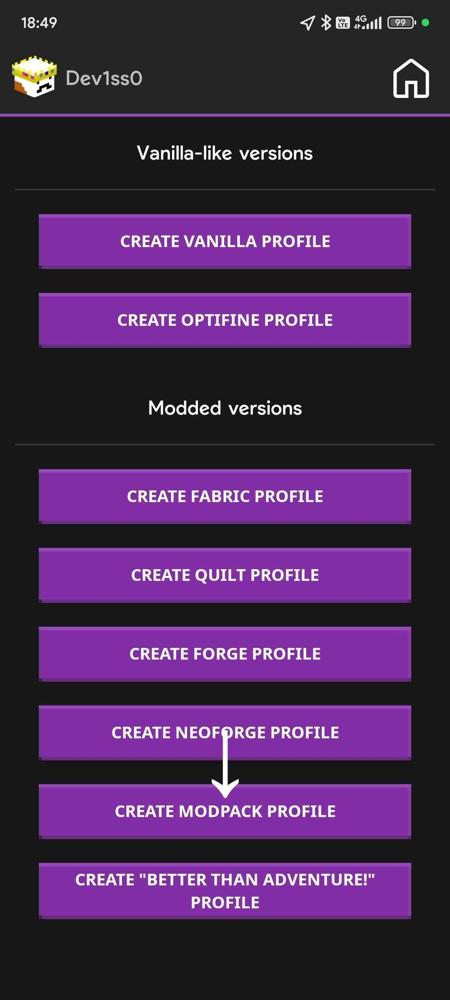

# Modpacks <!-- TODO: Update this. + mayhaps the packs names? -->
Modpacks, usually archived in a .zip form containing mod metadatas, are mods usually "duct taped" together to bring modded Minecraft in a more convenient way rather than handpicking mods one by one.

Popular examples of these can be found on both the [Modrinth](https://modrinth.com/modpacks) and the [CurseForge](https://www.curseforge.com/minecraft/modpacks) website.

## Official Modpacks from PojavLauncherTeam
* [PojavOptimize (crystall1nedev, Chuck_Norris_)](https://github.com/PojavLauncherTeam/PojavOptimize) - A collection of mods to improve the performance and user experience.
* [PojavOptimize (GaucovyAero)](https://www.mediafire.com/folder/6p1xqhmmihf7x/PojavOptimize) - For maximum FPS, this modpack ships with the lowest settings possible.

These modpacks are specially made for PojavLauncher, but it doesn't mean you can't try them on PC too!

# Installing Modpacks

## Android
1. Click on the profile section at top of the play button.

2. Click on "create new profile".

3. Click on "create modpack profile".

4.  Pick your desired modpack, enjoy!

## iOS

1. Go to profiles from the sidebar.

2. Press the "+" button

3. Once a prompt appears, press the "Modpack" option.

4. Pick your desired modpack, enjoy!

